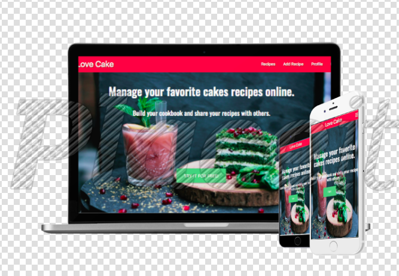

# Data Centric Development Milestone Project

## Online cookbook - Love Cake
---

[View the live project here.]( http://blooming-sea-03327.herokuapp.com/home) 

Online Cookbook Project Love Cake- Code Institute Milestone Project 3.

Love Cakes is a website where users can browse for cake recipes. Users can create their own account and there add, delete or edit their own recipes.

## User Experience (UX)
---

#### As a user I would like to:

- I want to immediately to know what the site is about.
- I want to easily navigate throughout the site.
- I want to able to search for a recipe using a specific ingredient or name.
- I want to able to create an account easily.
- I want to be able to manage my own recipes by editing or deleting.
- I want to be able to access the site from any kind of device.

#### Website goals:

- Provide clarity with a layout that satisfy the user needs.
- provide the possibilit of anyone user browse recipes without ewgister.
- Provide the possibility of register and add , edit or delete their own recipes.
- Provides a proper form where the user can download images and add all the text for the recipe.
- Provide simplicity avoiding overload information  and excess of content links.

#### Design

- Typography
    - The main colours chosed for this project were "Oswaldo"and "Sans-serif"

- Imagery 
     -  A  background hero image used for the home page and profile page. All the images of the recipes are added by the user via add recipe form.

## Features
---

#### Existing Features

- Easy to navigate navbar.
- Home index page with a big hero image and a link inviting to register.
- Easy registration form.
- Profile page with welcome plus username so the user knows he is logged in. Directly link to add a recipe.
- Add recipe form with possibility to add images and format the recipe.
- Buttons to delete and Edit recipes.
- Search functionallity to allow user, registered or not, to search for specific recipes by name.
- Responsive.

#### Features Left to Implement

- Create a better design.
- Create pagination.
- Add more information to the home page.
- Add a shopping list inside the user profile.
- Add catergories.

## Technologies Used

---

### Languages Used

- [HTML5](https://en.wikipedia.org/wiki/HTML5)
- [CSS 3](https://en.wikipedia.org/wiki/CSS)
- [JAVASCRIPT](https://pt.wikipedia.org/wiki/JavaScript) 
- [PYTHON](https://www.python.org/)  

### Frameworks, Libraries & Programs Used

- [Materialize] (https://materializecss.com/)
    - Grid system and pre made classes to allow formatation and responsiveness.
- [MONGODB] (https://www.mongodb.com/)
    - Used to store the database added by the user.
- [FLASK] (https://pt.wikipedia.org/wiki/Flask_(framework_web))
    - Used to connect to the database in mongodb.    
- [jQuery](https://jquery.com/) 
   - JQuery was used along with materialize.
- [Quill](https://quilljs.com/) 
   - Used the add recipe form.
- [GoogleFonts](https://fonts.google.com/)   
    - Google fonts was used to import "Oswald".
- [FontAwsome](https://fontawesome.com/) 
    - Font Awsome was used to add icons throughout the website.
- [Git](https://git-scm.com/) 
    - Git was used for version control by commiting  to and Pushing to GitHub.
- [GitHub](https://github.com/)   
    -  GitHub is being used to store the project.

## Testing
---

- The python code was validate by [PEP8](http://pep8online.com/) 
- Javascript code was validate by [JSHINT](https://jshint.com/)

- Manual testings and browser tests were conducted.
    - Login and Register forms and functionallity working correctly.
    - When user add a recipe in the add recipe form it pushes the recipe correctly to the recipes page.
    - All the recipes has their own id and can be seen in a individual page.
    - Only users can add recipes.
    - Users can only edit or delete their own recipes.
    - The search bar filters corretly the word input by the user, showing only recipes with the relevant content.
    - In case nothing is found a message will be displayes. 
    - The reset button return to the recipes page.
    - Links throughtout the website working as should. 
    - Website is responsive.

### Testing User Stories from User Experience (UX) Section

- I want to immediately to know what the site is about.
    - Clear information in the home page.
- I want to easily navigate throughout the site to find the recipes I am looking for.
    - The website is very easy to navigate with not so much page and straightforward.
- I want to able to search for a recipe using a specific ingredient or name.
    - the recipes page contain a search bar allowing the user to find the specific recipe.
- I want to able to create an account easily.
    - the create accoun form is very simple an working as it should.
- I want to be able to manage my own recipes by editing or deleting.
    - As a user , a edit button and a delete button will show in your own recipes.
- I want to be able to access the site from any kind of device.
    - The website is responsive.

## Deployment
---

The project was deployed to GitHub Pages using the following steps...

1. Tell Heroku which applications are required to run by adding ` pip3 freeze --local > requirements.txt ` to CLI
2. Create Procfile - ` echo web:python app.py>Procfile`
3. Login to Heroku. 
4.  Once logged in on your dashboard, we can click to `Create a New App`
5. Connect GitHub repository to Heroku.
6. Click on 'Reveal Config Vars', and tell Heroku which variables are required.
7. From the deploy section click `Deploy Branch`
8. Click `View`

#### Making a Local Clone

1. Log in to GitHub and locate the [GitHub Repository](https://github.com/AdrianaSchmit85/Love_cakes).
2. Under the repository name, by the left side of the green Gitpod button click in Code.
3. To clone the repository using HTTPS, under "Clone with HTTPS", copy the link.
4. Open Git Bash
5. Change the current working directory to the location where you want the cloned directory to be made.
6. Type git clone, and then paste the URL you copied in Step 3.
7. Press Enter. Your local clone will be created.
8. Click `Deploy Branch`
9. Click `View` to launch your new app.

#### Content

-  The content was written by the developer.

- [Materialize](https://materializecss.com/) were used throughout the project.

- The text for the Deployment section was copied from the [CodeInstituteSampleRead.me](https://github.com/Code-Institute-Solutions/SampleREADME). 

#### Media

- The images in this website were copied from google images.

#### Acknowledgements

- Great thanks to all the tutors for all the help, and to the Student Care. 
